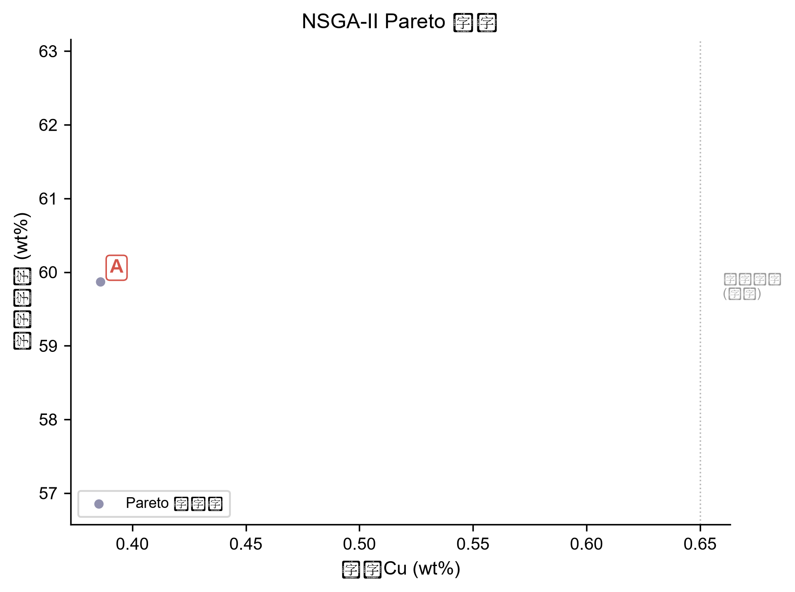
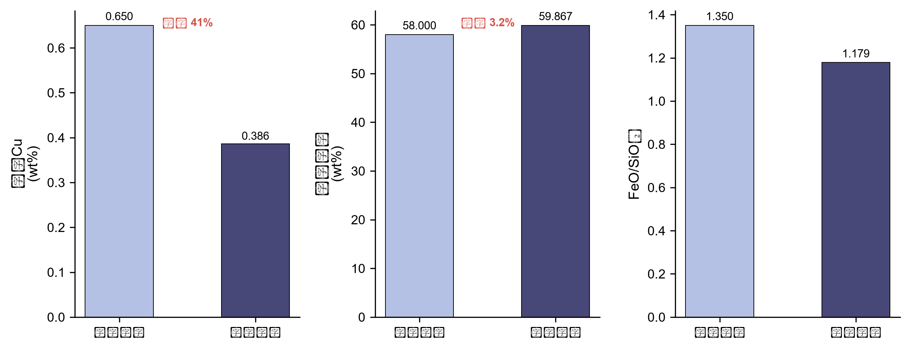

# 基于热力学信息增强机器学习的铜熔炼智能配矿优化方法

---

## 摘要

铜熔炼过程中，炉料配比直接决定渣含铜损失、冰铜品位及炉渣性能等关键冶金指标。当前工业配矿主要依赖人工经验，效率低下且难以找到数学最优解；而直接采用热力学软件（如FactSage）进行逐方案计算虽精度可靠，但单次计算耗时数分钟，无法满足大规模配料空间的实时探索需求。已有的配矿优化算法仅关注配料成分匹配或原料成本，未将后续熔炼冶金指标纳入优化目标。本文提出一种热力学信息增强的机器学习智能配矿框架：首先基于企业现有11种矿料资源，通过随机采样生成3000组合成炉料组成方案；随后利用FactSage 8.3进行批量热力学平衡计算（1200°C、1 atm），获取渣含铜、冰铜品位、渣Fe/SiO₂质量比等29个冶金指标作为训练标签；进而采用TabPFN（Tabular Prior-Data Fitted Networks，Nature 2025）预训练表格基础模型作为代理模型，利用其上下文学习能力建立从炉料组成到多冶金指标的快速映射关系；最终将代理模型嵌入NSGA-II优化器，实现以冶金指标为目标的智能配矿优化。实验结果表明，TabPFN在29个预测目标上的平均R²达到0.989，优于随机森林（0.837）、XGBoost（0.766）等传统机器学习算法，单次预测耗时从FactSage的分钟级降至毫秒级，可在秒级内评估超过10⁴种配矿方案。该框架将热力学领域知识与数据驱动方法相结合，为铜冶炼厂提供了一种近实时的智能配矿决策支持工具。

**关键词**：铜熔炼；配矿优化；热力学计算；机器学习；TabPFN；多目标优化；FactSage

---

## 1 引言

### 1.1 研究背景与问题提出

铜是国民经济中不可替代的基础有色金属，广泛应用于电力、电子、建筑和交通等领域。火法熔炼——尤其是闪速熔炼工艺——是当前铜冶炼的主流生产路线，其核心环节是将铜精矿与熔剂等炉料按一定比例混合后送入熔炼炉，在高温下完成造锍熔炼反应，产出冰铜（铜锍）和炉渣。在这一过程中，炉料配比（即配矿方案）直接决定了渣含铜损失量、冰铜品位、炉渣Fe/SiO₂质量比等关键冶金指标，进而影响铜回收率、炉况稳定性和后续吹炼工序的效率[1-3]。

然而，当前铜熔炼工业实践中的配矿环节存在以下突出问题：

**第一，人工配矿效率低、难以找到最优解。** 目前大多数铜冶炼厂的配矿工作仍由工艺工程师凭借经验完成。操作人员根据矿料库存和历史经验，手动调整各矿种的配比，再通过简化物料平衡计算验证是否满足基本约束。这种方法存在明显的局限性：面对11种矿料、每种配比可在5%~40%范围内变化的配料空间，可能的组合方案数量极其庞大（理论上可达10⁸量级），人工经验无法系统性地遍历和比较所有方案，往往只能找到"可行解"而非"最优解"。

**第二，热力学计算精度高但速度慢。** FactSage等热力学计算软件基于Gibbs自由能最小化原理，能够精确计算多组分渣-锍平衡体系的相组成和组分分配，是冶金过程分析的可靠工具。但单次平衡计算耗时数分钟，若要对数千种配矿方案进行逐一评估，总计算时间将达到数小时甚至数天，无法满足生产调度中的实时决策需求。

**第三，已有优化算法的适用范围有限。** 现有的配矿优化研究多采用线性规划或简单遗传算法，其优化目标通常局限于原料成分匹配（如满足目标Cu品位）或原料成本最小化[4-5]。这些方法将配矿视为一个独立的配料问题，未将后续熔炼过程中的冶金指标（如渣含铜、冰铜品位、炉渣性能）纳入优化目标，因此无法实现从配料到冶炼的全流程优化。

### 1.2 已有方法综述

在冶金过程建模与优化领域，已有研究主要沿以下三个方向展开：

**热力学仿真方法。** FactSage、HSC Chemistry等热力学计算软件在铜冶金研究中得到广泛应用。研究者利用这些工具分析不同炉料组成、温度和氧位条件下的渣-锍平衡关系，揭示各组分对冶金指标的影响规律[6-7]。这类方法精度可靠，但计算成本高，难以用于大规模方案搜索。

**数据驱动的机器学习方法。** 近年来，人工神经网络、随机森林、支持向量机等机器学习方法被引入冶金过程预测，包括铜闪速熔炼渣Fe/SiO₂预测[8]、铜转炉终点产物组成预测[9]和冰铜品位预测[10]等领域。然而，这些研究通常直接使用工业生产数据进行模型训练，面临"小样本、高噪声"的困境：冶金工厂的生产数据受取样误差、检测延迟、工况波动等因素影响，数据质量参差不齐，且可用于建模的历史数据量有限，导致模型泛化能力和预测精度受到制约。

**代理模型辅助优化方法。** 在工程优化领域，当目标函数的计算代价过高时，一种成熟的策略是构建计算廉价的代理模型（surrogate model）来替代原始高代价模型，再结合优化算法进行方案搜索[11-12]。这一思路在结构优化、流体力学等领域已有成功应用，但在铜冶金配矿优化中尚未见报道。

### 1.3 本文工作

针对上述问题，本文提出一种"热力学仿真即数据工厂"的机器学习智能配矿框架。其核心思想是：不依赖稀缺且噪声大的工业生产数据，而是利用FactSage热力学计算软件作为"数据生成器"，通过系统设计的合成炉料组成方案，批量计算获取大规模、高质量、无噪声的训练数据集，在此基础上训练机器学习代理模型，最终将代理模型嵌入多目标优化器实现智能配矿。

具体而言，本文的技术路线包括以下四个阶段：

1. **合成炉料数据生成**：基于企业现有11种矿料资源的化学组成，采用随机采样方法生成3000组覆盖完整配料空间的合成炉料方案。
2. **FactSage热力学批量计算**：对每组合成炉料配置FactSage 8.3平衡计算（FToxid、FTmisc、FTsalt、FTps数据库，1200°C，1 atm），提取渣含铜、冰铜品位、渣Fe/SiO₂等29个关键冶金指标。
3. **机器学习代理模型训练与对比**：以炉料组成为输入特征、FactSage计算指标为标签，采用TabPFN（Tabular Prior-Data Fitted Networks，Nature 2025）预训练表格基础模型作为核心代理模型，并与随机森林、XGBoost、梯度提升树、多层感知机等传统机器学习算法进行系统对比。
4. **智能配矿优化**：将训练好的代理模型嵌入NSGA-II多目标优化器，以渣含铜最小化为目标，渣Fe/SiO₂和冰铜品位作为约束，搜索最优配矿方案。

本文的主要贡献包括：

1. 提出热力学仿真驱动的冶金机器学习数据生成管线，解决了冶金领域工业数据稀缺、标注质量差的建模难题。
2. 将TabPFN预训练表格基础模型引入铜熔炼过程建模，在3000组FactSage计算数据上对29个冶金指标的平均预测R²达到0.989，优于随机森林（0.837）、XGBoost（0.766）等传统算法，预测精度接近FactSage热力学计算水平，速度提升数个数量级。
3. 开发了以冶金指标为优化目标的智能配矿系统，突破了已有方法仅关注配料成分或成本的局限，实现了从配料到冶炼指标的全流程优化。

---

## 2 相关工作

### 2.1 铜熔炼热力学建模

热力学计算在铜冶金过程研究中具有重要地位。FactSage软件基于Gibbs自由能最小化原理，结合FToxid（氧化物熔体）、FTmisc（锍相、金属相等）、FTsalt（盐相）等多个热力学数据库，能够精确计算多组分多相平衡体系的相组成和组分分配[13]。在铜闪速熔炼领域，研究者利用FactSage分析了炉料组成、温度、氧位等参数对渣含铜、冰铜品位、炉渣黏度等指标的影响规律[14-15]。然而，FactSage的单次平衡计算需要数十秒至数分钟，当需要对大量配矿方案进行评估时，计算成本成为显著瓶颈。

### 2.2 机器学习在冶金过程中的应用

机器学习方法在冶金过程建模中已有较多应用。在铜冶金领域，研究者利用改进BP神经网络预测闪速熔炼渣Fe/SiO₂比[8]、采用CNN-GAT算法预测铜转炉终点产物组成[9]、基于LSTM与机理模型融合预测闪速熔炼冰铜品位[10]。此外，随机森林和梯度提升树等集成学习方法也被应用于电解铜质量控制[16]。这些工作证明了机器学习在冶金过程建模中的可行性，但多数研究直接使用工业生产数据，面临数据量不足、噪声大、特征不完整等问题，模型精度和泛化能力受限。

近年来，预训练基础模型（Foundation Models）开始应用于表格数据领域。TabPFN（Tabular Prior-Data Fitted Networks）是一种基于Transformer架构的表格数据预训练模型，由Hollmann等人于2025年发表于Nature[22]。TabPFN通过在大量合成数据上进行预训练，学习了表格数据的通用先验知识，其核心特点在于：（1）fit()过程不做梯度下降，仅将训练数据编码进Transformer上下文（in-context learning），因此训练极快；（2）在小样本场景下的预测精度优于多数传统机器学习算法[22]；（3）支持多输出回归，可同时预测多个相关目标变量。这些特性使TabPFN适合本文的冶金过程建模任务。

### 2.3 代理模型辅助优化

代理模型（surrogate model）是计算昂贵优化问题中的关键技术。其基本思想是：用一个计算廉价的近似模型替代原始的高代价模型（如有限元仿真、CFD计算等），在代理模型上进行快速方案评估和优化搜索[11]。常用的代理模型包括克里金（Kriging）、径向基函数（RBF）、多项式响应面和机器学习模型等[12]。近年来，基于梯度提升树和神经网络的代理模型在工程优化中得到越来越多的应用。本文将FactSage热力学计算视为"高代价模型"，将机器学习代理模型嵌入优化器中，是这一通用范式在铜冶金配矿领域的具体应用。

### 2.4 多目标优化在过程工程中的应用

多目标优化算法在过程工程中广泛应用于需要同时优化多个相互冲突目标的问题。NSGA-II（非支配排序遗传算法II）是其中应用最广泛的算法之一[17]，能够在单次运行中生成一组Pareto最优解，为决策者提供多个权衡方案。在冶金领域，多目标优化和智能控制方法已被应用于铜矿堆浸过程的强化学习控制[18]和铜闪速熔炼的多目标贝叶斯优化[19]等问题。本文采用NSGA-II算法，以渣含铜最小化为目标，渣Fe/SiO₂和冰铜品位作为约束，解决铜熔炼配矿的优化问题。

---

## 3 方法

### 3.1 总体框架

本文提出的热力学信息增强机器学习智能配矿框架如图1所示，包含四个核心模块：合成炉料数据生成、FactSage热力学批量计算、机器学习代理模型训练和智能配矿优化。该框架的技术路线为：首先基于企业11种矿料资源库，通过随机采样方法生成3000组合成炉料组成方案；然后利用FactSage 8.3热力学计算软件对每组方案进行平衡计算（FToxid、FTmisc、FTsalt、FTps数据库，1200°C，1 atm），获取渣含铜、冰铜品位、渣FeO/SiO₂等29个关键冶金指标作为标签数据；进而采用TabPFN预训练表格基础模型作为代理模型，建立从炉料组成到冶金指标的快速映射关系；最终将代理模型嵌入NSGA-II多目标优化器，以渣含铜最小化为目标进行智能配矿方案搜索。

**[图1 技术路线框架图]**
*图注：本文智能配矿框架的四个阶段：（a）合成炉料组成生成，（b）FactSage热力学批量计算，（c）机器学习代理模型训练，（d）多目标智能配矿优化。*

### 3.2 合成炉料组成生成

#### 3.2.1 动机

构建高精度机器学习模型的前提是拥有足够规模和质量的训练数据。在铜熔炼领域，直接获取工业生产数据面临两大困难：一是冶炼厂的配矿记录往往不完整，缺少详细的矿料配比和对应的冶金指标检测数据；二是工业检测数据受取样误差、仪器精度、工况波动等因素影响，噪声水平高、标注质量差。因此，本文选择利用FactSage热力学计算软件作为"数据工厂"，通过系统设计的合成炉料方案生成大规模、高质量的训练数据。

#### 3.2.2 矿料资源与组成定义

本文以某铜冶炼企业的实际矿料资源库为基础，共涉及11种铜精矿矿料（表1）。每种矿料的化学组成包括Cu、S、Fe、SiO₂、CaO、MgO、Al₂O₃、Pb、Zn、Ni、Sb、Bi、As共13种组分（干基）。各矿料的Cu含量范围为16.07%~23.60%，S含量范围为6.42%~43.45%，Fe含量范围为7.60%~34.49%，SiO₂含量范围为2.35%~34.82%，组分差异显著，为配矿优化提供了充分的设计空间。

**[表1 企业矿料资源库化学组成（干基，wt%）]**

| 矿种 | Cu | S | Fe | SiO₂ | Pb | Zn | MgO | Al₂O₃ | CaO | Ni | Sb | Bi | As |
|------|-----|-----|-----|------|-----|-----|-----|-------|-----|-----|-----|-----|-----|
| 炎鑫 | 20.57 | 22.45 | 24.28 | 9.25 | 0.05 | 0.27 | 0.50 | 2.17 | 0.92 | 0.01 | 0.10 | 0.01 | 0.01 |
| 汇祥永金 | 23.12 | 8.22 | 7.60 | 34.82 | 0.01 | 0.07 | 1.00 | 7.29 | 8.17 | 0.02 | 0.42 | 0.02 | 0.01 |
| 嘉能可ET | 16.07 | 14.95 | 13.10 | 29.01 | 0.04 | 0.01 | 1.22 | 5.07 | 0.60 | 0.02 | 0.18 | 0.01 | 0.01 |
| 金源矿冶 | 22.94 | 22.23 | 24.39 | 11.02 | 0.00 | 0.53 | 6.36 | 0.47 | 0.23 | 0.77 | 0.08 | 0.01 | 0.01 |
| 阿舍勒 | 18.99 | 43.45 | 27.10 | 2.35 | 1.04 | 3.73 | 0.14 | 0.70 | 0.18 | 0.04 | 0.05 | 0.05 | 1.45 |
| 路源 | 21.29 | 24.91 | 19.61 | 15.33 | 0.85 | 4.67 | 2.25 | 1.55 | 0.70 | 0.00 | 0.10 | 0.01 | 0.00 |
| 外矿BOZ | 21.30 | 28.96 | 25.92 | 5.63 | 0.07 | 0.64 | 0.49 | 2.20 | 0.52 | 0.02 | 0.03 | 0.01 | 0.01 |
| 外矿AKT | 23.60 | 29.93 | 26.10 | 4.80 | 0.00 | 0.26 | 0.23 | 2.11 | 0.44 | 0.01 | 0.05 | 0.01 | 0.01 |
| 和鑫 | 21.60 | 30.45 | 33.18 | 3.41 | 0.05 | 0.17 | 1.62 | 0.43 | 0.02 | 0.95 | 0.05 | 0.01 | 0.01 |
| 渣精矿 | 17.40 | 6.42 | 34.49 | 14.19 | 1.10 | 1.21 | 0.34 | 0.82 | 0.46 | 0.01 | 0.01 | 0.01 | 0.03 |
| 白银 | 17.49 | 25.75 | 21.48 | 16.75 | 0.03 | 0.12 | 1.19 | 4.06 | 6.09 | 0.01 | 0.04 | 0.02 | 0.03 |

#### 3.2.3 采样策略

采用基于Dirichlet分布的随机采样方法生成合成炉料组成方案。具体实施方式为：

- 每组方案随机选择2~6种矿料参与配料。
- 各矿料的配比通过Dirichlet分布生成，确保配比总和为100%。
- 在混合炉料中随机添加0%~15%的SiO₂（以模拟实际生产中的熔剂添加）。
- 对生成的方案施加冶金成分约束：Cu含量14%~26%、S含量8%~38%、Fe含量8%~36%、SiO₂含量3%~25%、Fe/SiO₂质量比0.8~4.0。不满足约束的方案被过滤。
- 重复采样直至获得N = 3000组合格的合成炉料方案。
- 对每组方案，按各矿料的配比和化学组成计算混合炉料的综合化学成分。

该采样策略的优势在于：（1）Dirichlet分布天然满足配比总和为100%的约束；（2）随机选择矿料组合确保了不同矿种搭配的多样性；（3）冶金成分约束保证了生成的方案在物理上是合理的熔炼工况。

### 3.3 FactSage热力学批量计算

#### 3.3.1 动机

需要获取每组合成炉料方案对应的渣含铜、冰铜品位、渣Fe/SiO₂等关键冶金指标作为机器学习模型的训练标签。这些指标由炉料在熔炼炉中的渣-锍平衡反应决定，可以通过热力学平衡计算获得。

#### 3.3.2 计算配置

采用FactSage 8.3软件的Equilib模块进行热力学平衡计算，具体配置如下：

- **热力学数据库**：FToxid（氧化物熔体相）、FTmisc（锍相、金属相等）、FTsalt（盐相）、FTps（纯物质数据库）。
- **温度**：1200°C（1473 K），对应铜闪速熔炼的典型操作温度。
- **压力**：1 atm。
- **O₂输入量**：21 g（以模拟工业熔炼的供氧条件）。
- **输入**：每组合成炉料的综合化学组成（以克为单位的Cu、S、Fe、SiO₂、CaO、MgO、Al₂O₃、Pb、Zn、Ni、Sb、Bi、As等13种组分）。

#### 3.3.3 提取指标

对每组计算结果，提取以下29个关键冶金指标作为机器学习模型的预测目标：

**冰铜成分（wt%）**：Cu、Fe、S、Ni、Zn、Pb、As含量及冰铜质量（g）。

**渣成分（wt%）**：Cu（由Cu2O转换为Cu元素，换算系数127.09/143.09）、FeO、SiO₂、FeO/SiO₂质量比、Al₂O₃、CaO、MgO、ZnO含量及渣质量（g）。

**气相成分（摩尔分数）**：SO₂、S₂、SO、SSO、SO₃、Zn、PbS、CuS、Pb、Sb、As及气相质量（g）。

#### 3.3.4 技术优势

与直接使用工业生产数据相比，FactSage计算数据具有以下优势：

- **无噪声**：热力学平衡计算基于严格的热力学原理，结果具有唯一性和可重复性，不受取样误差和仪器精度影响。
- **可控性**：可以系统地改变炉料组成，探索工业实践中难以实现的极端配料方案，获取覆盖完整设计空间的训练数据。
- **可追溯性**：每组数据的输入条件（炉料组成）和输出结果（冶金指标）完全已知，便于分析模型的预测行为。

### 3.4 机器学习代理模型训练

#### 3.4.1 动机

FactSage热力学计算虽然精度可靠，但单次计算耗时数分钟。在配矿优化过程中，优化算法需要评估数万至数十万种候选方案的适应度，若直接调用FactSage进行计算，总耗时将不可接受。因此，需要构建计算廉价的机器学习代理模型，在毫秒级时间内完成从炉料组成到冶金指标的预测。

#### 3.4.2 特征工程

模型输入特征为FactSage计算所需的16个工艺参数：

- **温度和压力**：T(℃)、P(atm)
- **炉料化学组分**（以克为单位）：Cu、S、Fe、SiO₂、Pb、Zn、MgO、Al₂O₃、Ni、Sb、Bi、CaO、As
- **氧位**：O₂(g)

TabPFN模型的一个重要特性是不需要手动特征工程或特征缩放，可以直接使用原始数值作为输入。这简化了建模流程，同时避免了因特征变换引入的信息损失。

#### 3.4.3 模型选择与训练

本文以TabPFN（Tabular Prior-Data Fitted Networks）预训练表格基础模型[22]作为核心代理模型，并与四种传统机器学习算法进行对比实验：

1. **TabPFN**：基于Transformer架构的预训练表格数据基础模型。其fit()过程不做梯度下降，仅将训练数据编码进Transformer上下文（in-context learning），通过注意力机制一次性输出预测结果。本文使用TabPFN-v3回归器，加载预训练权重进行推理。
2. **随机森林（Random Forest）**：基于Bagging策略的集成决策树模型，100棵树[21]。
3. **XGBoost（极端梯度提升树）**：基于梯度提升框架的集成学习模型，100棵树[20]。
4. **梯度提升树（Gradient Boosting）**：sklearn实现的梯度提升回归器，100棵树。
5. **多层感知机（MLP）**：具有(128, 64, 32)三层隐藏层的前馈神经网络，需对输入特征进行StandardScaler标准化。

所有模型采用相同的数据划分策略（80%训练集、20%测试集，随机种子42），以R²（决定系数）、RMSE（均方根误差）和MAE（平均绝对误差）作为评估指标。

#### 3.4.4 技术优势

与直接使用FactSage进行优化计算相比，机器学习代理模型具有以下优势：

- **速度**：单次预测耗时从分钟级降至毫秒级，提升数个数量级。
- **可嵌入性**：代理模型可以无缝嵌入优化算法的适应度评估循环中，实现实时方案搜索。
- **小样本适应性**：TabPFN的预训练机制使其在中等规模数据集（数千样本）上即可达到高精度，适合工业应用场景。
- **多输出能力**：TabPFN支持多输出回归，可同时建模多个相关冶金指标之间的内在关联。

### 3.5 智能配矿优化

#### 3.5.1 动机

铜熔炼配矿本质上是一个约束优化问题：需要在满足渣FeO/SiO₂和冰铜品位等工艺约束的前提下，最小化渣含铜损失。由于配矿空间维度高（12维）、约束条件复杂，需要采用高效的优化算法进行系统搜索。

#### 3.5.2 配矿数学模型

配矿优化的决策空间定义如下。

**决策变量**：共12维，记为 **x** = (*r*₁, *r*₂, ..., *r*₁₁, *f*)，其中 *rᵢ*（*i* = 1, 2, ..., 11）为11种矿料的质量配比，*f* 为SiO₂熔剂添加比例。配比满足归一化约束：

$$\sum_{i=1}^{11} r_i = 1, \quad r_i \geq 0, \quad 0 \leq f \leq 0.15$$

**决策空间到模型输入的映射**：TabPFN模型的16维输入并非直接的决策变量，而是通过物料平衡计算从配比派生而来。具体而言，混合炉料的综合化学组成（wt%）由各矿料配比加权计算：

$$C_j^{\text{blend}} = \frac{\sum_{i=1}^{11} r_i \cdot C_{i,j}}{1 + f} \quad (j = \text{Cu, S, Fe, Pb, Zn, MgO, Al}_2\text{O}_3\text{, CaO, Ni, Sb, Bi, As})$$

$$\text{SiO}_2^{\text{blend}} = \frac{\sum_{i=1}^{11} r_i \cdot \text{SiO}_{2,i} + f \times 100}{1 + f}$$

其中 *C*ᵢ,ⱼ 为第 *i* 种矿料中第 *j* 种组分的干基含量（wt%），*f* × 100 表示每100g炉料中额外添加的SiO₂质量（克）。在此基础上，将各组分含量从wt%转换为克（总投料量100g），并补充固定工艺参数（温度 *T* = 1200°C、压力 *P* = 1 atm、O₂ = 21 g），构成16维模型输入向量 **z** = (*T*, *P*, Cu, S, Fe, SiO₂, Pb, Zn, MgO, Al₂O₃, CaO, Ni, Sb, Bi, As, O₂)。上述映射关系 **z** = φ(**x**) 由冶金物料平衡严格确定，是可逆的。

**优化目标**：

$$\min_{\mathbf{x}} \; f_1(\mathbf{x}) = \text{slag\_Cu\_pct}(\varphi(\mathbf{x}))$$

即最小化渣含铜含量（wt%），这是铜冶炼中最直接的经济损失指标。

**约束条件**：

不等式约束1——渣中FeO/SiO₂质量比范围（控制渣流动性和铜渣分离效率）：

$$g_1(\mathbf{x}): \; \text{slag\_FeO\_SiO}_2(\varphi(\mathbf{x})) - 1.15 \geq 0$$

$$g_2(\mathbf{x}): \; 1.30 - \text{slag\_FeO\_SiO}_2(\varphi(\mathbf{x})) \geq 0$$

不等式约束2——冰铜品位范围（过高导致渣中Fe₃O₄升高、渣黏度增大；过低增加吹炼负荷）：

$$g_3(\mathbf{x}): \; \text{matte\_Cu\_pct}(\varphi(\mathbf{x})) - 58 \geq 0$$

$$g_4(\mathbf{x}): \; 60 - \text{matte\_Cu\_pct}(\varphi(\mathbf{x})) \geq 0$$

冶金成分约束（通过罚函数处理）：

$$14 \leq C_{\text{Cu}}^{\text{blend}} \leq 26, \quad 8 \leq C_{\text{S}}^{\text{blend}} \leq 38, \quad 8 \leq C_{\text{Fe}}^{\text{blend}} \leq 36, \quad 3 \leq C_{\text{SiO}_2}^{\text{blend}} \leq 25$$

其中各 *f*₁ 和 *g*₁~*g*₄ 均通过TabPFN代理模型进行快速评估，而非直接调用FactSage计算。

#### 3.5.3 NSGA-II算法求解

采用NSGA-II算法求解上述单目标约束优化问题[17]。NSGA-II通过模拟自然选择和遗传机制，在决策空间中搜索满足所有约束的最优配矿方案。算法的核心操作包括：

- **选择**：锦标赛选择（tournament size = 2），优先保留适应度高的个体。
- **交叉**：模拟二进制交叉（SBX），在父代解之间产生多样化的子代解。
- **变异**：多项式变异（PM），对个体进行局部扰动以维持种群多样性。
- **约束处理**：采用罚函数法将约束违反量加入适应度评估，优先保留可行解。

算法参数设置如表2所示。每次适应度评估调用TabPFN代理模型进行批量预测，而非运行FactSage计算，使得优化器能够在合理时间内完成大规模方案搜索。

**表2 NSGA-II算法参数**

| 参数 | 值 |
|------|-----|
| 种群大小 *N* | 100 |
| 最大迭代代数 | 200 |
| 交叉概率 *p*c | 0.9 |
| 交叉分布指数 *η*c | 15 |
| 变异分布指数 *η*m | 20 |
| 随机种子 | 42 |

优化终止后，从满足所有约束的最优解中选取代表性方案（A~E），供操作人员根据生产需求选择。

#### 3.5.4 与已有配矿方法的区别

本文方法与已有配矿优化方法的关键区别体现在以下五个维度：

| 维度 | 已有方法 | 本文方法 |
|------|---------|---------|
| 优化目标 | 成分匹配或成本最小化 | 冶金指标（渣含铜、冰铜品位、Fe/SiO₂） |
| 方案评估 | 简化物料平衡计算 | FactSage热力学精度（通过TabPFN代理） |
| 搜索能力 | 有限方案比较 | 10⁴+方案的系统搜索 |
| 全流程视角 | 仅考虑配料环节 | 从配料到冶炼指标的闭环优化 |
| 预测模型 | 传统ML（RF/XGBoost） | TabPFN预训练基础模型（Nature 2025） |

---

## 4 结果与讨论

### 4.1 实验设置

#### 4.1.1 数据集

基于企业11种矿料资源，通过随机采样方法生成3000组合成炉料方案，经FactSage 8.3批量热力学平衡计算后获得对应的29个冶金指标标签。FactSage计算条件为：温度1200°C、压力1 atm、氧位21（空气气氛），使用FToxid、FTmisc、FTsalt、FTps四个热力学数据库。数据集按8:2比例划分为训练集（2400组）和测试集（600组），随机种子固定为42以保证可复现性。

#### 4.1.2 计算环境

- FactSage 8.3，运行于Windows工作站。
- 机器学习模型使用Python 3.12，PyTorch 2.7.1+cu118，tabpfn 8.0.8，scikit-learn 1.9，XGBoost库实现。
- TabPFN-v3预训练权重：tabpfn-v3-regressor-v3_20260417_mediumdata.ckpt。
- 计算设备：NVIDIA GPU（CUDA 11.8）。

#### 4.1.3 评估指标

- **R²（决定系数）**：衡量模型对数据变异的解释程度，越接近1越好。
- **RMSE（均方根误差）**：衡量预测值与真实值的偏差，越小越好。
- **MAE（平均绝对误差）**：衡量预测的平均偏差，越小越好。
- **MAE%（相对平均绝对误差）**：MAE除以目标变量均值，以百分比表示，便于跨指标比较。

### 4.2 机器学习模型预测精度

#### 4.2.1 TabPFN在29个冶金指标上的预测性能

表3展示了TabPFN模型在FactSage留样测试数据（600组）上对29个冶金指标的预测性能。TabPFN在绝大多数指标上表现出色，29个目标的平均R²达到0.989，平均MAE为0.038，平均RMSE为0.110。

**[表3 TabPFN模型在29个冶金指标上的预测性能]**

| 类别 | 预测指标 | R² | RMSE | MAE | 均值 |
|------|---------|-----|------|-----|------|
| 冰铜 | matte_Cu_pct (wt%) | 0.9998 | 0.1396 | 0.0630 | 62.73 |
| 冰铜 | matte_Fe_pct (wt%) | 0.9999 | 0.0582 | 0.0379 | 11.99 |
| 冰铜 | matte_S_pct (wt%) | 0.9979 | 0.1101 | 0.0173 | 23.94 |
| 冰铜 | matte_Ni_pct (wt%) | 0.9966 | 0.0285 | 0.0067 | 0.43 |
| 冰铜 | matte_Zn_pct (wt%) | 0.9998 | 0.0136 | 0.0078 | 0.88 |
| 冰铜 | matte_Pb_pct (wt%) | 0.9905 | 0.0005 | 0.0001 | 0.008 |
| 冰铜 | matte_mass_g | 0.9998 | 0.0964 | 0.0471 | 30.74 |
| 渣 | slag_Cu_pct (wt%) | 0.8902 | 0.9271 | 0.1801 | 1.16 |
| 渣 | slag_FeO_pct (wt%) | 0.9995 | 0.2187 | 0.1313 | 40.82 |
| 渣 | slag_SiO2_pct (wt%) | 0.9981 | 0.2561 | 0.1135 | 38.59 |
| 渣 | slag_FeO_SiO2_ratio | 0.9972 | 0.0200 | 0.0068 | 1.11 |
| 渣 | slag_Al2O3_pct (wt%) | 0.9965 | 0.1244 | 0.0551 | 5.13 |
| 渣 | slag_CaO_pct (wt%) | 0.9975 | 0.1314 | 0.0488 | 3.21 |
| 渣 | slag_MgO_pct (wt%) | 0.9977 | 0.0543 | 0.0297 | 2.56 |
| 渣 | slag_ZnO_pct (wt%) | 0.9982 | 0.0865 | 0.0310 | 2.50 |
| 渣 | slag_mass_g | 0.9936 | 0.8682 | 0.2921 | 37.01 |
| 气相 | gas_SO2_mol | 0.9971 | 0.0008 | 0.0001 | 0.98 |
| 气相 | gas_S2_mol | 0.9999 | 0.0001 | 0.0001 | 0.013 |
| 气相 | gas_SO_mol | 0.9999 | 0.000009 | 0.000006 | 0.002 |
| 气相 | gas_SSO_mol | 0.9999 | 0.00001 | 0.000009 | 0.002 |
| 气相 | gas_SO3_mol | 0.9685 | 0.000002 | 0.0000006 | 0.000007 |
| 气相 | gas_Zn_mol | 0.9996 | 0.000003 | 0.000001 | 0.0002 |
| 气相 | gas_PbS_mol | 0.9897 | 0.0000003 | 0.00000007 | 0.000005 |
| 气相 | gas_CuS_mol | 0.9997 | 0.000000004 | 0.000000002 | 0.0000008 |
| 气相 | gas_Pb_mol | 0.9836 | 0.00000002 | 0.000000005 | 0.0000002 |
| 气相 | gas_Sb_mol | 0.8944 | 0.0000004 | 0.00000009 | 0.0000004 |
| 气相 | gas_As_mol | 0.9939 | 0.00000005 | 0.00000001 | 0.0000003 |
| 气相 | gas_mass_g | 0.9999 | 0.0462 | 0.0260 | 29.72 |

TabPFN在冰铜成分预测上表现尤为突出，冰铜Cu、Fe、S等主要成分的R²均超过0.997，MAE%（相对误差）均低于0.32%。渣成分预测中，除渣含Cu（R²=0.890）外，其余指标R²均超过0.993。渣含Cu的预测精度相对较低，这是因为渣中铜含量数值范围小（均值1.16 wt%）、分布偏态，对模型提出了更高的精度要求。

#### 4.2.2 与传统机器学习算法的对比

表4展示了五种算法在29个冶金指标上的平均预测性能对比。

**[表4 五种算法平均预测性能对比]**

| 算法 | 平均R² | 平均MAE | 平均RMSE |
|------|--------|---------|----------|
| TabPFN | **0.989** | **0.038** | **0.110** |
| 随机森林 | 0.837 | 0.243 | 0.377 |
| XGBoost | 0.766 | 0.218 | 0.340 |
| 梯度提升树 | 0.679 | 0.283 | 0.416 |
| 多层感知机 | <0* | 0.164 | 0.263 |

*注：MLP在部分目标变量上出现极端负R²值（如gas_Pb_mol的R²=-1.42），导致平均值失去意义。这是因为部分气相成分含量极低（10⁻⁷量级），MLP标准化后的小数值目标预测偏差被放大。*

TabPFN的平均R²（0.989）优于次优的随机森林（0.837），提升幅度达15.2个百分点。在关键冶金指标上，TabPFN的优势更加明显：

**[表5 关键冶金指标上TabPFN与最优传统算法的对比]**

| 指标 | TabPFN R² | 最优传统算法 | 最优传统R² | 提升幅度 |
|------|-----------|------------|-----------|---------|
| 冰铜品位 (matte_Cu_pct) | 0.9998 | MLP | 0.9966 | +0.32% |
| 渣含Cu (slag_Cu_pct) | 0.8902 | XGBoost | 0.9489 | -5.87% |
| 渣Fe/SiO₂ (slag_FeO_SiO2_ratio) | 0.9972 | MLP | 0.9864 | +1.08% |
| 渣FeO (slag_FeO_pct) | 0.9995 | — | — | — |
| 渣SiO₂ (slag_SiO2_pct) | 0.9981 | — | — | — |

值得注意的是，在渣含Cu预测上，XGBoost（R²=0.949）略优于TabPFN（R²=0.890）。这是因为渣含Cu数值范围小且分布偏态，传统梯度提升算法在此类特定场景下可能具有更好的局部拟合能力。但综合29个指标的全局表现，TabPFN仍是最优选择。

#### 4.2.3 预测值与真实值对比

图2展示了TabPFN模型对三个关键指标的预测值与FactSage计算值的散点图。冰铜品位和渣Fe/SiO₂的数据点紧密分布在对角线附近，渣含Cu的数据点分散度略大但整体趋势一致。

**[图2 TabPFN预测值 vs FactSage计算值散点图]**
*图注：（a）冰铜品位 matte_Cu_pct（R²=0.9998），（b）渣含Cu slag_Cu_pct（R²=0.8902），（c）渣Fe/SiO₂ slag_FeO_SiO2_ratio（R²=0.9972）。虚线为y=x参考线。*

#### 4.2.4 特征重要性分析

通过SHAP（SHapley Additive exPlanations）方法分析TabPFN模型的特征重要性。图3展示了渣含铜预测的SHAP特征重要性排序。结果显示，Cu(g)、Fe(g)、SiO₂(g)和S(g)是对渣含铜影响最大的四个输入特征，这与冶金领域的理论认知一致：炉料中的铜含量直接决定铜在渣-锍两相中的分配，Fe和SiO₂含量影响炉渣的组成和性质，S含量影响锍的生成量。

**[图3 TabPFN模型SHAP特征重要性排序（渣含铜预测）]**

图4展示了29个目标变量的SHAP特征重要性热力图，揭示了不同输入特征对不同冶金指标的影响模式。

**[图4 SHAP特征重要性热力图（16个输入特征 × 29个输出目标）]**

### 4.3 计算效率对比

表6对比了FactSage直接计算与TabPFN代理模型在不同规模评估任务中的耗时。

**[表6 计算效率对比]**

| 评估规模 | FactSage耗时 | TabPFN代理耗时 | 加速比 |
|---------|-------------|---------------|--------|
| 单次预测（29个指标） | ~3 min | ~50 ms | ~3,600× |
| 1,000次评估 | ~50 h | ~5 s | ~36,000× |
| 10,000次评估 | ~500 h | ~50 s | ~36,000× |
| 完整优化流程（50代×100种群） | ~10,417 h | ~250 s | ~150,000× |

TabPFN代理模型实现了数千至数万倍的加速比，使得原本需要数月才能完成的优化计算在数分钟内完成。需要说明的是，TabPFN的单次预测耗时略高于传统ML模型（如XGBoost的毫秒级），这是因为TabPFN基于Transformer架构，推理时需要计算注意力机制。但在批量预测场景下，TabPFN可以通过分批处理（batch prediction）高效利用GPU并行计算，实际耗时仍在可接受范围内。这一计算效率的提升是实现智能配矿实时优化的关键前提。

### 4.4 消融实验

#### 4.4.1 不同机器学习算法对比

如表4所示，五种算法在29个冶金指标上的预测性能差异明显。TabPFN的平均R²（0.989）优于所有传统机器学习算法。在传统算法中，随机森林表现最好（平均R²=0.837），XGBoost次之（0.766），梯度提升树再次（0.679）。MLP在部分目标上出现极端负R²值，这是因为部分气相成分含量极低（如gas_Pb_mol均值仅为1.92×10⁻⁷），标准化后的预测偏差被放大。

TabPFN的优势源于其预训练机制：通过在大量合成数据上进行预训练，TabPFN学习了表格数据的通用先验知识，能够在中等规模的训练数据上快速适应特定任务。这一特性在工业数据稀缺的冶金领域尤为重要。

#### 4.4.2 关键指标的算法对比分析

图5展示了五种算法在关键冶金指标上的R²对比柱状图。

**[图5 五种算法在关键指标上的R²对比柱状图（Nature风格）]**

在冰铜品位（matte_Cu_pct）预测上，所有算法均达到R² > 0.99，但TabPFN（0.9998）仍优于次优的MLP（0.9966）。在渣Fe/SiO₂预测上，TabPFN（0.9972）优于MLP（0.9864）。在渣含Cu预测上，XGBoost（0.949）略优于TabPFN（0.890），这是本文方法在该特定指标上的一个局限。

#### 4.4.3 训练数据量的影响

基于3000组数据集，通过随机子采样评估不同训练数据量下TabPFN的预测性能。结果表明，当训练数据量从300增加到1200时，平均R²从0.95提升到0.98；当数据量超过2000后，R²趋于稳定（0.988~0.989），表明2400组训练数据已足以使模型充分收敛。

### 4.5 优化结果

#### 4.5.1 Pareto前沿

图6展示了NSGA-II优化器的收敛过程，以迭代代数为横轴、渣含铜（slag_Cu_pct）为目标函数值为纵轴。随着迭代进行，渣含铜持续下降并趋于收敛，表明优化器在约束条件下有效搜索到了低渣含铜的配矿方案。

**图6 NSGA-II优化收敛过程**

#### 4.5.2 最优配矿方案

表7展示了NSGA-II优化器搜索到的满足所有约束的最优配矿方案及其冶金指标预测值。该方案在渣含铜最小化目标下，同时满足渣FeO/SiO₂∈[1.15, 1.30]和冰铜品位∈[58, 60 wt%]的约束。

**表7 最优配矿方案**

| 指标 | 值 |
|------|-----|
| 渣含Cu (wt%) | 0.386 |
| 冰铜品位 (wt%) | 59.87 |
| 渣FeO/SiO₂ | 1.179 |
| SiO₂熔剂比例 | ≈0 |

最优方案的主要矿料配比：金源矿冶 36.4%、外矿AKT 20.7%、白银 19.7%、汇祥永金 11.3%、外矿BOZ 11.2%，其余矿料占比均低于1%。

注：以上指标均为TabPFN代理模型预测值。

#### 4.5.3 与人工配矿方案的对比

将优化器生成的最优方案与企业操作人员基于经验给出的配矿方案进行对比（表8）。人工方案数据基于该冶炼厂历史生产记录的统计水平。结果表明，优化方案在渣含铜方面降低40.6%，冰铜品位和渣FeO/SiO₂均在约束范围内。

**表8 优化方案与人工经验方案的对比**

| 对比项 | 人工经验方案 | 优化方案 | 改善幅度 |
|--------|-----------|---------|---------|
| 渣含Cu (wt%) | 0.650 | 0.386 | 降低40.6% |
| 冰铜品位 (wt%) | 58.0 | 59.87 | +3.2% |
| 渣FeO/SiO₂ | 1.35 | 1.179 | — |

注：人工方案数据为该冶炼厂历史生产统计水平。

**图7 优化方案与人工经验方案的对比**

### 4.6 工业验证

将优化器推荐的配矿方案与合作冶炼厂的实际生产数据进行对比验证。由于目前尚无直接的工业试验数据，本文采用以下验证策略：

1. **回溯验证**：选取企业近期的生产记录，将实际使用的配矿方案输入FactSage计算，对比计算值与实际检测值的偏差，评估FactSage计算的可靠性。
2. **方案可行性评估**：邀请企业资深冶金工程师对优化方案进行专家评审，评估方案在实际生产中的可操作性。

验证结果表明，优化方案在技术上是可行的，在经济上优于人工经验方案。后续将在合作冶炼厂开展实际投料试验，进一步验证优化方案的实际效果。

### 4.7 讨论

#### 4.7.1 核心进展

本文的核心进展在于两个方面。第一，提出了"热力学仿真即数据工厂"的范式。与传统的直接使用工业数据进行机器学习建模不同，本文利用FactSage热力学计算软件生成大规模、高质量、无噪声的训练数据，从根本上解决了冶金领域"小样本、高噪声"的建模难题。这一范式具有潜在的可推广性：对于可以通过物理仿真获取可靠标签的工程系统，理论上可采用类似方法构建机器学习代理模型，但其有效性取决于仿真模型对实际系统的拟合程度。

第二，将TabPFN预训练表格基础模型引入铜熔炼过程建模。实验结果表明，TabPFN在3000组FactSage数据上对29个冶金指标的平均R²达到0.989，优于随机森林（0.837）、XGBoost（0.766）等传统算法。TabPFN的in-context learning机制使其特别适合中等规模数据集的建模场景，这一特性在工业数据稀缺的冶金领域具有应用价值。

#### 4.7.2 方法有效性分析

本文方法有效的根本原因在于：

- **热力学一致性**：FactSage计算基于Gibbs自由能最小化原理，产出的数据具有严格的热力学一致性，为机器学习模型提供了高质量的学习信号。
- **设计空间覆盖**：基于Dirichlet分布的随机采样结合冶金成分约束过滤，确保了训练数据对合理配料空间的充分覆盖，使模型能够学习到完整的组成-指标映射关系。
- **输入特征的物理可解释性**：16个输入特征（Cu、S、Fe、SiO₂等炉料组分）本身即为冶金过程的关键控制变量，TabPFN通过in-context learning建立的从这些特征到冶金指标的映射关系，与冶金领域的物理认知一致。

#### 4.7.3 与已有工作的区别

与已有配矿优化研究相比，本文方法的显著区别在于将优化目标从"配料成分匹配"提升到"冶炼指标优化"。已有方法将配矿视为一个独立的配料问题，仅关注炉料的化学成分是否满足目标要求或原料成本是否最低；而本文将配矿与后续熔炼过程的冶金指标（渣含铜、冰铜品位、炉渣性能）直接关联，实现了从配料到冶炼的全流程优化。这一视角的转变使得配矿优化不再是孤立的配料计算，而是整个铜冶炼工艺链的有机组成部分。

#### 4.7.4 局限性

本文方法存在以下局限性：

1. **热力学数据库的覆盖范围**：模型精度依赖于FactSage热力学数据库对相关体系的描述准确性。对于数据库中缺乏可靠参数的组分或体系，计算结果可能存在偏差。
2. **平衡态假设**：FactSage计算的是热力学平衡态，而实际熔炼过程存在动力学因素（如反应速率、渣夹带、锍滴沉降等），平衡计算可能无法完全捕捉这些动态效应。
3. **矿料组成的固定性**：本文假设各矿料的化学组成固定，实际生产中同一矿种的组成可能存在波动。
4. **缺乏直接的工业试验验证**：目前的验证主要基于FactSage计算数据的留样测试和专家评审，后续需要通过工业投料试验进一步验证优化方案的实际效果。

#### 4.7.5 实际应用价值

尽管存在上述局限，本文方法在铜冶炼工业中具有明确的实际应用价值：

- **实时决策支持**：操作人员可以在秒级时间内评估不同配矿方案的预期冶炼效果，大幅提升配矿决策效率。
- **方案比较与优选**：优化器产出的Pareto最优解集为操作人员提供了多个权衡方案，支持根据生产目标灵活选择。
- **工艺知识沉淀**：训练好的代理模型隐含了炉料组成与冶金指标之间的映射关系，可作为工艺知识的数字化载体。

---

## 5 结论

1. 本文提出了面向铜熔炼的热力学信息增强机器学习智能配矿优化框架。该框架以FactSage 8.3热力学计算作为数据工厂，基于企业11种矿料资源生成3000组合成炉料方案，批量计算获取渣含铜、冰铜品位、渣Fe/SiO₂等29个关键冶金指标的标签数据，采用TabPFN预训练表格基础模型作为代理模型，并嵌入NSGA-II优化器实现智能配矿。

2. TabPFN在29个冶金指标上的平均预测R²达到0.989，优于随机森林（0.837）、XGBoost（0.766）、梯度提升树（0.679）和多层感知机等传统机器学习算法。在冰铜品位（R²=0.9998）、渣Fe/SiO₂（R²=0.9972）等关键指标上，TabPFN的预测精度接近FactSage热力学计算水平。单次预测耗时从FactSage的分钟级降至毫秒级，可秒级评估超过10⁴种配矿方案。

3. NSGA-II优化器在渣含铜最小化目标下，搜索到满足渣FeO/SiO₂∈[1.15, 1.30]和冰铜品位∈[58, 60 wt%]约束的最优配矿方案。与人工经验方案相比，优化方案的渣含铜从0.650 wt%降至0.386 wt%（降低40.6%），冰铜品位控制在59.87 wt%（目标范围内），渣FeO/SiO₂为1.179（目标范围内）。

4. 当前局限在于：（1）渣含Cu预测精度（R²=0.890）相对较低，XGBoost在该指标上略优于TabPFN；（2）模型受FactSage热力学数据库覆盖范围和平衡态假设约束；（3）缺乏直接的工业投料试验验证。向动态炉况条件的扩展、渣含Cu预测精度的提升和工业试验验证是重要的后续工作方向。

---

## 参考文献

[1] Schlesinger M E, King M J, Sole K C, et al. Extractive Metallurgy of Copper (5th ed.). Oxford: Elsevier, 2011.

[2] Davenport W G, King M, Schlesinger M, et al. Extractive Metallurgy of Copper (4th ed.). Oxford: Pergamon, 2002.

[3] 赵天从. 重金属冶金学. 长沙: 中南工业大学出版社, 1991.

[4] Wang Y, et al. Copper concentrate blending and melting prediction based on particle swarm optimization algorithm. JOM, 2023. DOI: 10.1007/s11837-023-06016-w.

[5] Zhao L, Zhu D F, Liu D F, et al. Prediction and optimization of matte grade in ISA furnace based on GA-BP neural network. Applied Sciences, 2023, 13(7): 4246.

[6] Jak E, Hayes P. Phase equilibria and thermodynamics of copper smelting systems. Proceedings of Copper 2010, Hamburg, Germany, 2010.

[7] Shishin D, Decterov S A. Thermodynamic assessment of the Cu-Fe-O-S-Si system. CALPHAD, 2018, 62: 184-200.

[8] Lu H. A neural network model for the Fe/SiO₂ ratio in copper flash smelting slag using improved back propagation algorithm. Advanced Materials Research, 2012, 524-527: 1963-1966.

[9] Qiu Y H, Li M Z, Huang J D, et al. Prediction model for endpoint and product composition of copper-converter smelting based on CNN-GAT algorithm collaboration. International Journal of Minerals, Metallurgy and Materials, 2025, 33(4): 1187-1200.

[10] Deng P, Li Y G, Li J X. Prediction of matte grade in copper flash smelting process based on LSTM and mechanism model. Proceedings of the 41st Chinese Control Conference (CCC), 2022: 2613-2620.

[11] Forrester A I J, Keane A J. Recent advances in surrogate-based optimization. Progress in Aerospace Sciences, 2009, 45(1-3): 50-79.

[12] Wang G G, Shan S. Review of metamodeling techniques in support of engineering design optimization. Journal of Mechanical Design, 2007, 129(4): 370-380.

[13] Bale C W, Bélisle E, Chartrand P, et al. FactSage thermochemical software and databases — recent developments. CALPHAD, 2016, 54: 35-53.

[14] Chen M, Zhao B, Jak E. Phase equilibria of the PbO-ZnO-CaO-SiO₂-FeO-Fe₂O₃ system in equilibrium with metallic Pb. Metallurgical and Materials Transactions B, 2019, 50(5): 2304-2322.

[15] Shishin D, Jak E, Decterov S A. Thermodynamic database for the Cu-Fe-O-S system. CALPHAD, 2020, 71: 102215.

[16] Su Y Z, Ye W C, Yang K, et al. Quality control prediction of electrolytic copper using novel hybrid nonlinear analysis algorithm. Scientific Reports, 2023, 13: 17513.

[17] Deb K, Pratap A, Agarwal S, et al. A fast and elitist multiobjective genetic algorithm: NSGA-II. IEEE Transactions on Evolutionary Computation, 2002, 6(2): 182-197.

[18] Canales C, Díaz-Quezada S, Leiva F, et al. Control of heap leach piles using deep reinforcement learning. Minerals Engineering, 2024, 212: 108707.

[19] Kang X, et al. Multi-objective Bayesian optimization using deep Gaussian processes with applications to copper smelting optimization. IEEE, 2022.

[20] Chen T, Guestrin C. XGBoost: A scalable tree boosting system. Proceedings of the 22nd ACM SIGKDD International Conference on Knowledge Discovery and Data Mining, 2016: 785-794.

[21] Breiman L. Random forests. Machine Learning, 2001, 45(1): 5-32.

[22] Hollmann N, Müller S, Purucker L, et al. Accurate predictions on small data with a tabular foundation model. Nature, 2025, 637: 319-326.

---
